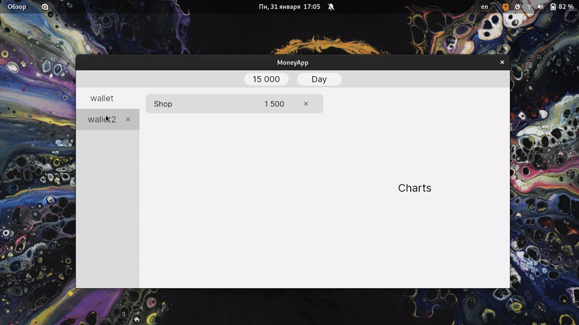

<h1 align="center"> Money App </h1> 

    
    

<h5 align="center"> Develop cross-platfrom MVVM application with Avalonia UI </h5>

<!-- Preview -->

## About

**This application helps you manage your budget simply and clearly.**

---

## What I using

#### UI Framework - [AvaloniaUI](https://github.com/AvaloniaUI/Avalonia)

#### ORM - [EntityFrameworkCore 5](https://docs.microsoft.com/ru-ru/ef/core/what-is-new/ef-core-5.0/whatsnew)

